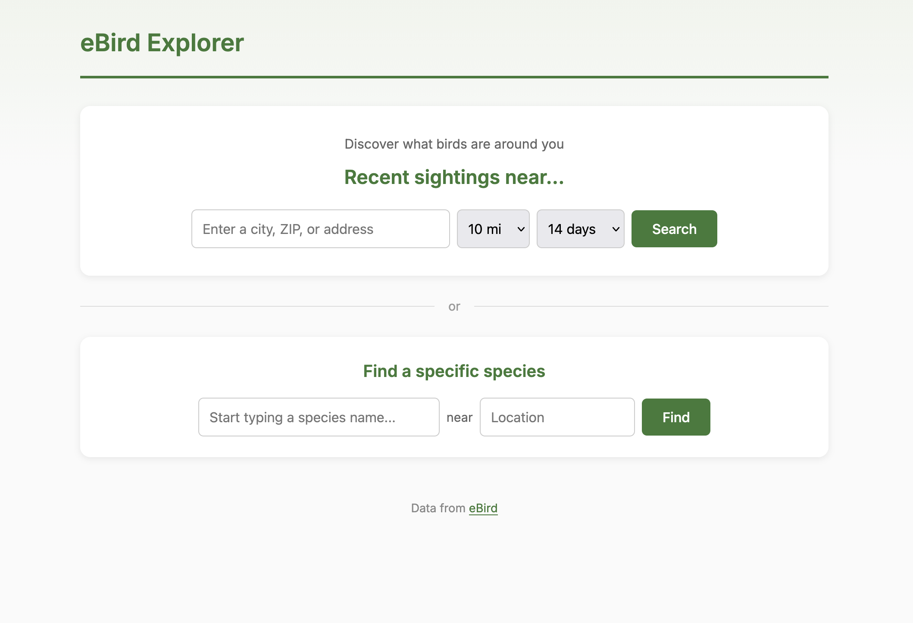
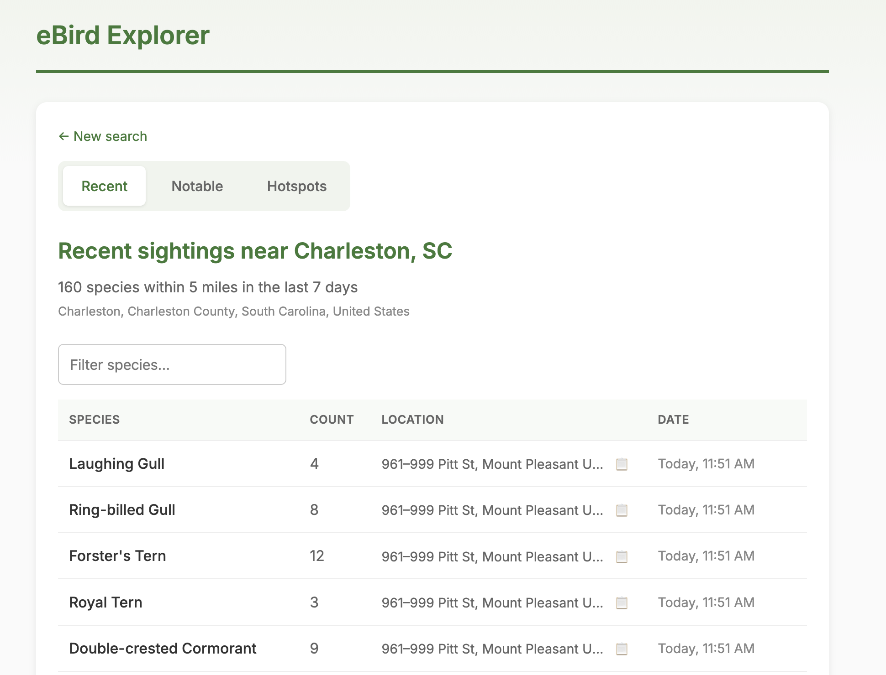
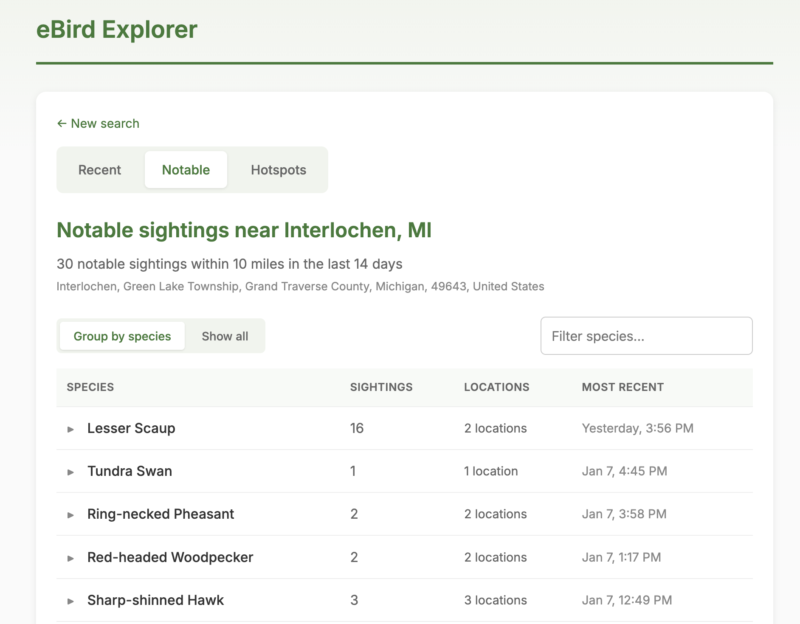
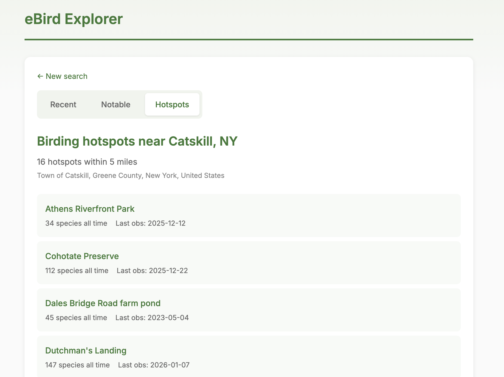

# eBird Explorer

A simple web tool for exploring eBird data. Quickly answer common birding questions like "what's been seen near me lately?" or "where was that interesting species reported?"



## Features

- **Location Search**: Enter a town, ZIP code, or address to see recent bird observations within a configurable radius
- **Notable Sightings**: Find rare and unusual birds in your area, filterable by date range
- **Hotspot Explorer**: Browse hotspots near a location and see recent activity
- **Species Lookup**: Search for where a specific species has been seen recently, with autocomplete

### Screenshots

Recent sightings in Charleston, SC:


Notable sightings near Interlochen, MI:


Hotspots near Catskill, NY:


## Setup

1. Get a free eBird API key at https://ebird.org/api/keygen

2. Clone the repo and set up your environment:
   ```bash
   git clone https://github.com/mtnlark/ebird-explorer.git
   cd ebird-explorer
   cp .env.example .env
   # Edit .env and add your API key
   ```

3. Install dependencies and run:
   ```bash
   pip install -r requirements.txt
   uvicorn backend.main:app --reload
   ```

4. Open http://localhost:8000

## Tech Stack

- **Backend**: Python, FastAPI, httpx
- **Frontend**: Server-rendered HTML with vanilla JavaScript
- **APIs**: eBird API, OpenStreetMap Nominatim (geocoding)

## Deployment

The app is configured for deployment on Vercel. Push to your repo and connect it to Vercel, making sure to set the `EBIRD_API_KEY` environment variable.

## License

MIT
